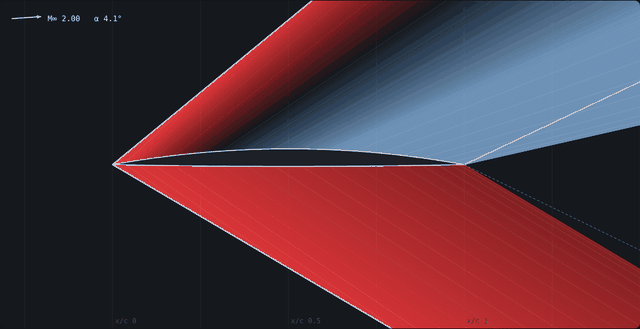
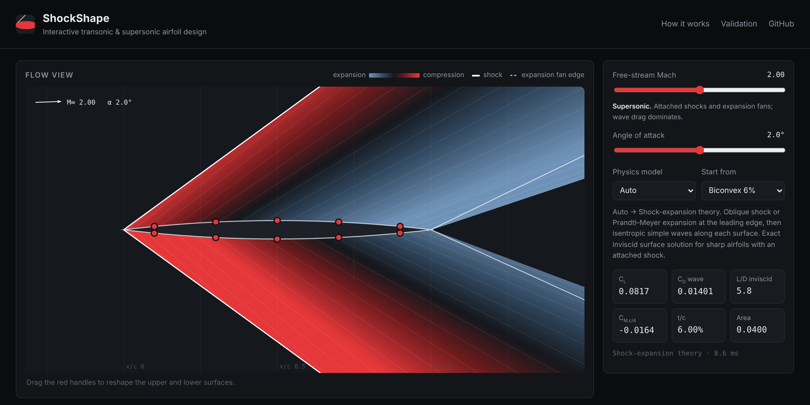
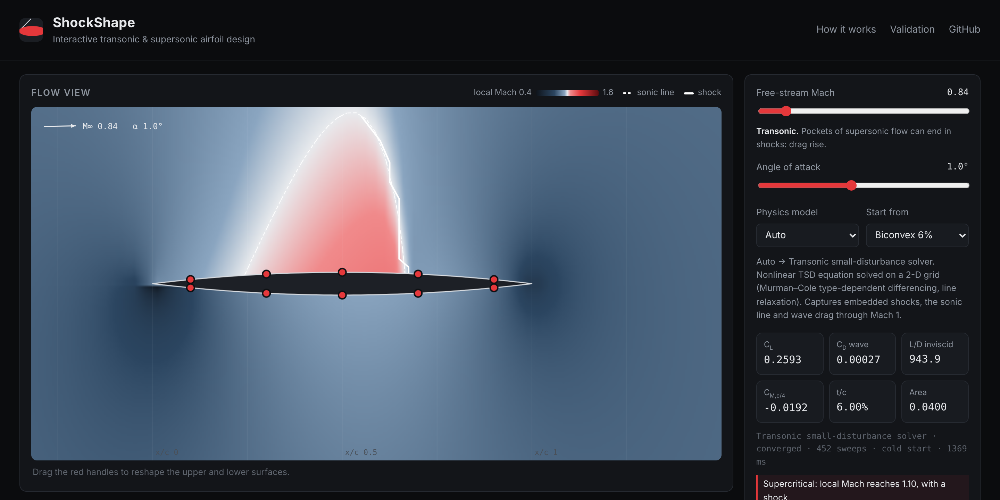
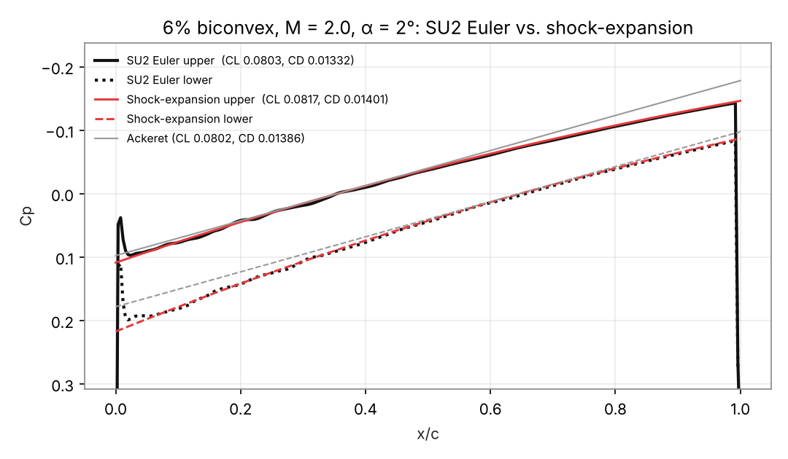
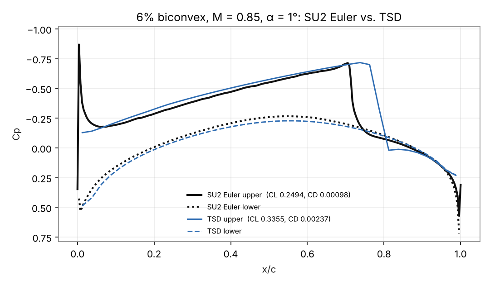

# ShockShape

**Draw an airfoil, sweep it from Mach 0.5 to 3.5, and watch a gradient-based optimizer reshape it to minimize wave drag. Everything runs in the browser.**

**Live app: https://kkgogada.github.io/shockshape/**



ShockShape extends my research paper, *Comparative Supersonic Airfoil Analysis and Adjoint-Based Shape Optimization Using SU2*, into an interactive tool. The paper ran SU2 on a fixed set of airfoils. The app makes the design loop itself visible: change the shape, the flow answers, sensitivities come back, the shape updates, and the loop repeats.

| Supersonic: shock-expansion theory | Transonic: TSD solver with an embedded shock |
|---|---|
|  |  |

## What it does

- **Airfoil editor.** Ten draggable handles set the upper and lower surface heights at x/c = 0.1, 0.3, 0.5, 0.7 and 0.9. They map exactly onto a sharp-edged CST (Kulfan) parameterization: class function x(1−x) times a degree-4 Bernstein shape function.
- **Three physics models behind one interface.** Every model maps (shape, Mach, α) to (C<sub>p</sub>(x), C<sub>L</sub>, C<sub>D</sub>, C<sub>M</sub>). The editor and the optimizer never know which model is running.

  | Model | Regime | What it is |
  |---|---|---|
  | Shock-expansion theory | M ≳ 1.3 | Oblique shock or Prandtl–Meyer expansion at the leading edge, then isentropic simple-wave turning along each surface. Linearized (Ackeret) theory is drawn alongside it. |
  | Transonic small-disturbance (TSD) solver | M ≈ 0.5–1.3 | Nonlinear TSD equation on a stretched 2-D grid. Uses Murman's fully conservative type-dependent scheme with Newton-linearized line relaxation, grid sequencing and Anderson acceleration, plus a wake cut with Kutta condition and a compressible-vortex far field. Captures embedded shocks and the sonic line. Shock drag comes from the Oswatitsch entropy formula. |
  | Neural surrogate | its training range | A 12→96→96→67 tanh MLP. Its forward pass and **exact reverse-mode gradients** take about 80 lines of JavaScript, with no ML runtime. |

- **Flow view.** At supersonic speeds the app draws the wave system, coloured by pressure (compression vs. expansion): leading-edge shocks or fans, simple-wave regions, and approximate trailing-edge waves. At transonic speeds it shows the computed local-Mach field with the sonic line and shocks.
- **Optimizer.** It minimizes C<sub>D</sub> at a target C<sub>L</sub> (α is a design variable), subject to a minimum **t/c** or a minimum **cross-sectional area**, using an augmented Lagrangian with BFGS steps. Results are compared fairly: the optimized shape against the *starting shape trimmed to the same lift*.

## The idea the app is built to show

Gradient-based shape optimization lives or dies on the cost of the gradient.

| Gradient source | Cost per design iteration (11 design variables) |
|---|---|
| Central finite differences (shock-expansion) | ~22 flow evaluations + line search |
| Forward finite differences through the TSD solver | ~11 nonlinear flow solves, and noisy, because shocks move between grid cells |
| Back-propagation through the surrogate | **1 backward pass**, independent of the number of variables |

The adjoint method in SU2 gets the full gradient for roughly the cost of one extra flow solve, whatever the number of design variables. In the browser, the differentiable surrogate plays that role. The app displays the evaluation counter so the difference is visible, not just claimed.

The constraint matters as much as the gradient. Unconstrained drag minimization always collapses to a zero-thickness flat plate. With a constraint, the optimizer recovers textbook supersonic results:

- **Fixed t/c → double-wedge.** Linear theory minimizes ∫y′² dx at a fixed peak thickness by using straight lines.
- **Fixed area → biconvex.** At a fixed area, the Euler–Lagrange equation gives a parabolic arc.

Example (Mach 2, C<sub>L</sub> = 0.15, t/c ≥ 5%, starting from the cambered biconvex):

| | C<sub>D</sub> | Flow evaluations |
|---|---|---|
| Starting shape trimmed to C<sub>L</sub> = 0.15 | 0.02136 | – |
| Optimized with shock-expansion + finite differences | 0.01615 (−24.4%) | 2,164 |
| Optimized with the surrogate + back-prop | 0.01608 claimed, **0.01614 confirmed by shock-expansion** (−24.5%) | 60 |
| Linear-theory ideal (sharp double wedge) | 0.01552 | – |

The surrogate's optimum is re-evaluated with the physics model automatically when the run finishes, because a surrogate's answer is only a claim until the solver confirms it.

## Validation

### Against closed-form theory (automated, `npm test`)

- Prandtl–Meyer function, oblique-shock relations and C<sub>p</sub>* match NACA 1135 table values.
- Flat-plate shock-expansion lift matches a hand calculation, and C<sub>D</sub> = C<sub>L</sub> tan α holds exactly.
- Biconvex wave drag converges to Ackeret's 16t²/(3β) as t → 0.
- TSD lift matches Prandtl–Glauert (2πα/β) to within 2%, and TSD thickness pressures match the analytic thin-airfoil source solution.
- Shock-free subsonic flow gives exactly zero wave drag (d'Alembert).
- TSD at M = 1.5 agrees with Ackeret (< 3%) and shock-expansion (< 5%).
- Surrogate back-prop gradients match finite differences of the network. Surrogate-optimized designs are re-checked with the true model.
- The Python pipeline's geometry matches the JS geometry to 1e-12, via fixtures exported from JS.

### Against SU2 Euler (spot checks run with the pipeline in `pipeline/su2/`)

6% biconvex, SU2 v8.1.0, Roe + MUSCL, unstructured triangle meshes from gmsh:

| Case | SU2 C<sub>L</sub> | SU2 C<sub>D</sub> | App C<sub>L</sub> | App C<sub>D</sub> |
|---|---|---|---|---|
| M 2.0, α 2° (shock-expansion) | 0.0803 | 0.01332 (27k cells) | 0.0817 | 0.01401 |
| M 1.4, α 0° (shock-expansion) | 0.0003 | 0.01843 (27k cells) | 0 | 0.02014 |
| M 0.85, α 1° (TSD) | 0.2494 | 0.00098 | 0.3355 | 0.00237 |

**Mesh convergence, M 2.0, α 0°.** Shock-expansion gives C<sub>D</sub> = 0.011124. SU2 gives 0.010469 on 27k cells (−5.9%), 0.010779 on 104k (−3.1%) and 0.010973 on 367k (−1.4%). The SU2 error roughly halves with each refinement, converging on the shock-expansion value. Most of the coarse-mesh gap comes from the leading-edge shock being smeared over a few cells.



**Transonic: where the reduced model shows its limits.** TSD reproduces the shape of the Euler pressure distribution well, but it places the shock about 6% chord further aft. As a result it over-predicts lift by about a third and wave drag by about 2×. This is the classic behaviour of isentropic potential models with shocks of this strength. The app says so whenever a supercritical solution is shown.



## Limits, stated plainly

- **Inviscid only.** There is no skin friction, no boundary layer and no separation, so "L/D" in the app is an inviscid number.
- **TSD needs care.**
  - TSD is a thin-airfoil, isentropic model: it over-predicts shock strength relative to Euler (see above).
  - Strongly lifting transonic cases converge slowly, and like full-potential methods they can have more than one solution. The solver reports non-convergence instead of showing a number it doesn't trust.
  - Optimization through TSD works, but with finite differences it is slow (~5–10 s per design iteration) and noisy. That is exactly the cost that adjoints and surrogates exist to remove.
- **Shock-expansion needs an attached leading-edge shock.** The app tells you when the shock detaches and switches to TSD in auto mode up to M 1.6. Trailing-edge waves in the flow view are drawn approximately, and wave interactions are not computed.
- **The bundled surrogate is a placeholder.** It was trained on **shock-expansion data** (M 1.4–3.0, α −2…6°, 7,315 samples; validation R² = 0.9997 for C<sub>D</sub>). That lets the whole chain run and be tested end to end. The pipeline below regenerates it from SU2 Euler runs, which is the intended source. The app labels the surrogate's provenance and warns when it is used outside its training range.

## Offline surrogate pipeline (`pipeline/`)

```bash
pip install numpy gmsh matplotlib            # SU2 binaries: https://su2code.github.io/download.html
python pipeline/sample_design_space.py --n 2000 --mach 1.4 3.0 --alpha -2 6 --out data/design_points.csv

# placeholder data (what the bundled model was trained on):
node tools/generate-analytic-dataset.mjs data/design_points.csv data/dataset.csv

# real data:
python pipeline/su2/prepare_cases.py data/design_points.csv cases/       # airfoil.dat + gmsh mesh + SU2 cfg per case
JOBS=8 cases/run_all.sh                                                  # SU2_CFD on every case
python pipeline/su2/collect_results.py cases/ data/dataset_su2.csv       # skips unconverged cases
python pipeline/su2/compare_case.py cases/case_00000 docs/check.png      # SU2 vs. app overlay

python pipeline/train_surrogate.py data/dataset_su2.csv models/surrogate.json --source su2-euler --hidden 96 96 --epochs 2500
```

- **Sampling.** Shapes are sampled as a perturbed parabolic thickness and camber distribution (Latin hypercube), so every sample is closed, non-crossing and has a realistic leading-edge angle.
- **Training.** Pure NumPy. A tanh network rather than ReLU, on purpose: the optimizer uses the network's gradients, and a ReLU net's gradient is piecewise constant.
- **Model format.** The exported JSON is a set of layer matrices plus normalization constants, so it maps one-to-one onto `src/surrogate.js`.

## Run it locally

```bash
python3 -m http.server 8000      # any static server works; then open http://localhost:8000
npm test                         # JS engine tests (node >= 18, no dependencies)
python -m unittest discover -s tests -p "test_*.py"   # pipeline tests
node tools/evaluate.mjs --preset "Biconvex 6%" --mach 2 --alpha 2      # engines from the command line
```

There is no build step and no runtime dependencies: plain ES modules, Canvas 2D and a Web Worker for the solvers.

## Layout

```
index.html, styles.css      page
src/geometry.js             CST parameterization, handles, area, thickness
src/gasdynamics.js          Prandtl–Meyer, oblique shock, isentropic relations
src/shockExpansion.js       shock-expansion + Ackeret engine
src/tsd.js                  transonic small-disturbance solver
src/surrogate.js            MLP forward + reverse-mode gradient
src/engines.js              common engine interface
src/optimizer.js            augmented-Lagrangian BFGS optimizer
src/worker.js               solves and optimization off the main thread
src/render.js, src/app.js   drawing and interaction
pipeline/                   sampling, SU2 case generation/collection, training
tools/                      CLI evaluation, analytic dataset, fixtures
tests/                      node:test + unittest suites
```

## License

MIT, © 2026 Khushal Gogada
